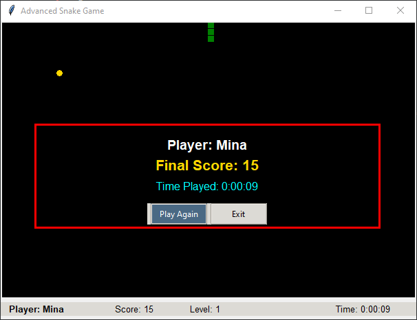
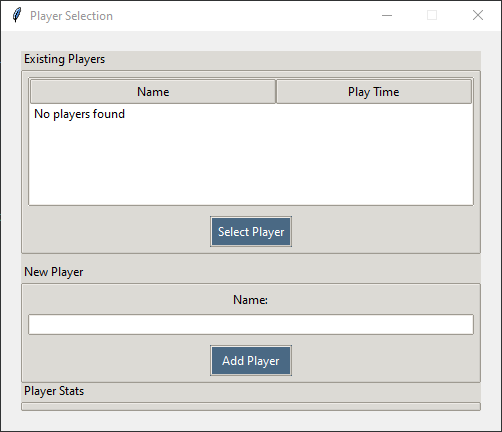

# 🐍 Advanced Snake Game with Player Tracking

A modern Python implementation of the classic Snake game with player profiles, time tracking, and persistent high scores.

## ✨ Features

- **Player Profiles**:
  - Create new players or select existing ones
  - Track play time and game statistics per player
  - Persistent SQLite database storage

- **Enhanced Gameplay**:
  - Multiple power-ups (bonus points, speed boosts)
  - Progressive level difficulty
  - Real-time score and time display

- **Professional UI**:
  - Clean player selection interface
  - Detailed game statistics
  - Responsive design

